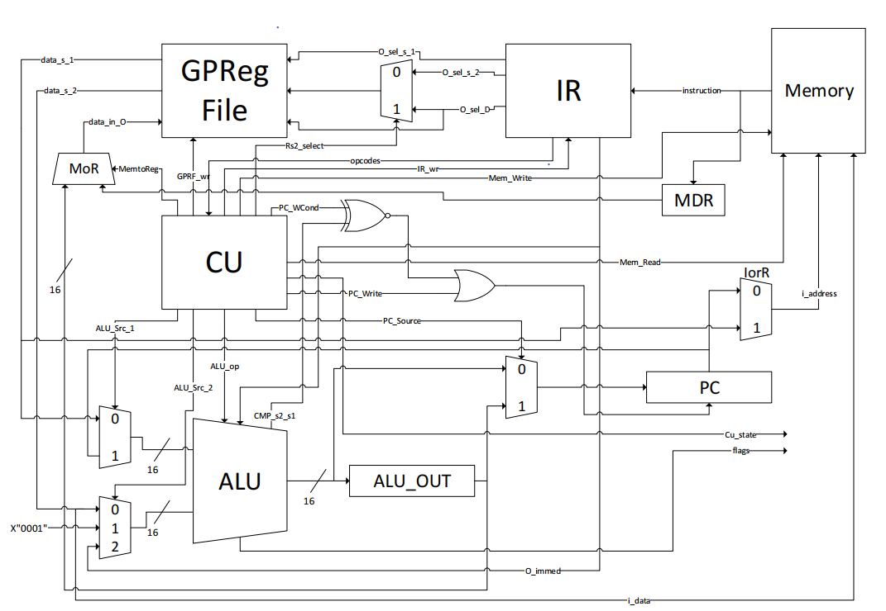
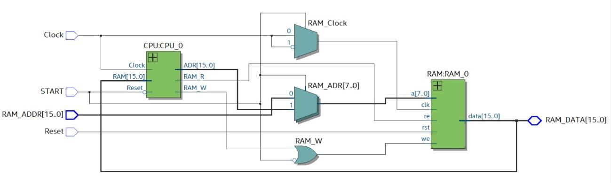
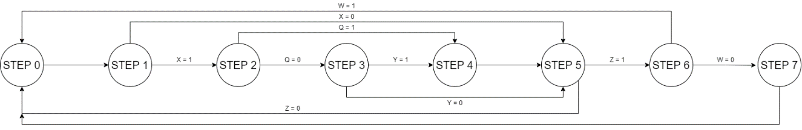
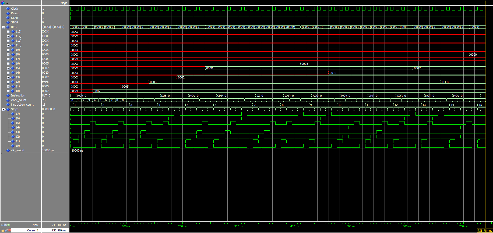
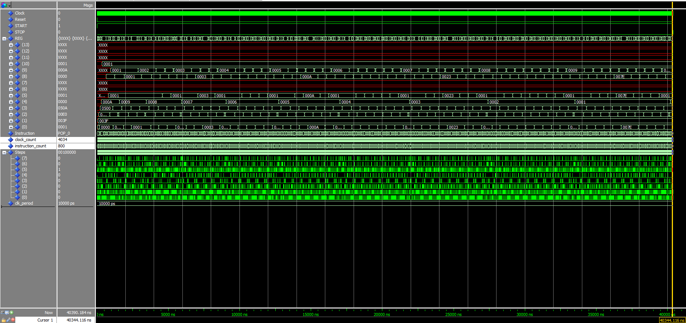
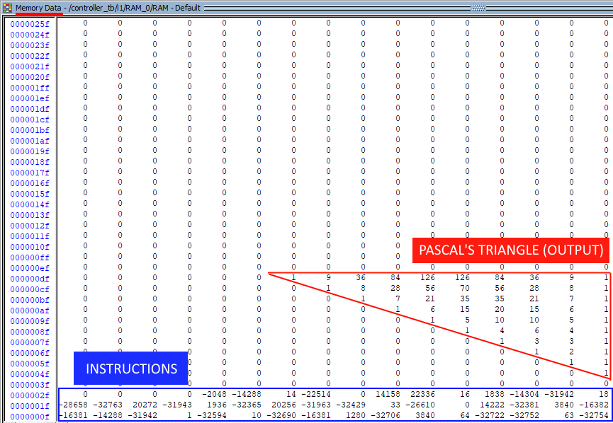

## Project Title

Design of a 16-bit RISC Processor Using VHDL


## Introduction

A central processing unit (CPU) is the electronic circuitry that executes instructions such as basic arithmetic, logic, controlling and input/output operations specified by the instructions in the program. To perform these instructions, there are components inside the CPU such as CU, ALU, Registers, MAR, RAM, etc.
Processors are used in a wide range of applications such as computers, telephones, satellites, IoT systems and so on.
Modern processors employ intelligent processor architectures to exploit the parallelism of the computer programs. Von-Neumann architecture, Harvard architecture, CISC (Complex Instruction Set Computer), RISC (Reduced Instruction Set) can be given as examples for these processors.
Most complex instructions in CISC processor take many processor cycles to execute. In a pipelined processor, the overall speed of the processor depends on the slowest operation being performed. This means that the relatively complex instructions even slow down the execution of simpler instructions. That is why the RISC architecture is so popular in today’s technology. First, simpler instructions could speed up the pipeline and thus provide a performance improvement. Second, simple instruction set implies less computer hardware and thus reduced cost. Therefore, the design goal was to provide simple instructions, which could execute faster. Compilers could use these instructions to construct complex operations.
In this report, we are going to present our design of a 16-bit RISC processor using VHDL. The fetch, decode and execute parts of the instruction cycle will be explained and the advantages of our design with respect to the base article of the project will be discussed. Environmental and economical aspects of a CPU design is an important issue for the future and will also be explained throughout the project report.


## Design and Solution

#### Reference Design

Schematic of the article given on the project instructions page is as given below.



As can be seen from the schematic, design units are given as blocks. So, the interna design of these blocks and thus, the design of the general schematic is up to the readers’ choices. Names of the registers and data lines are changed in our design to ensure the user friendliness of the written VHDL code.

Some multiplexers and the logic gates are implemented into the design units for better readability. Data busses for the design units are connected to the same general line and the enable signals are used to specify the direction of the data flow.

Keeping this in mind, our RTL schematic is as given below.
Instruction set of the base design is as given below. Some of these instructions are implemented using a single opcode. As an example, MOV, STORE and LOAD instructions are implemented using a single opcode. IR is modified to realize this operation. Nevertheless, outputs of the functions match with the theoretical ones for our design.

Now, we will be explaining our design and instruction set. First, here is our schematic for the inner design of the CPU.


### Solution


As can be seen from the schematic, we have made several changes to the reference schematic. These changes can be listed as below.

- We have used a single data bus for the register connections to reduce power consumption. Thus, the production cost of the chip is lowered.
- Number of instructions are increased to 31. Thus, opcodes are extended to 5 bits. As a result, source registers are taken one by one, and the destination register is chosen according to the IR8-IR10 bits of the instruction register for three operand instructions. This means that the destination register for the three operand instructions can be chosen from R0 to R6 using these bits.
- Immediate data and the memory address are taken as 16-bit using an extra cycle.
- A stack segment and a stack pointer are added to the design. To ensure that the code segment and the stack segment do not crosses addresses, stack is located at the end of the RAM.
- An improved FSM is used in the CU to control the timing of the enable signals dynamically. This way, instruction life cycle depends on the type of the instruction. As a result, faster CPU operation is acquired. Details will be given later.


### Our Design

Top level schematic is made up of two components, CPU and RAM. Connections between these two is established using separate address and data buses. Schematic of the Controller (top level entity) is as shown below.



Data bus and address bus are 16 bits, and the RAM is configured before the program starts. To configure the RAM, START signal is disabled and the specified values are loaded to the specified addresses located in the RAM synchronously. Memory capacity of the unit is 64K x 16 bits. Thus, CPU can address up to 64K locations.

CPU is designed in a structural fashion. Control Unit (CU), Arithmetic-Logic Unit (ALU), Register File, Program Counter, Stack Pointer, Temporary Registers (ATR and TR), Accumulator, Instruction Register (IR), Memory Address Register (MAR) and Flag Register (FR) are the components of this structure. There is a phase difference of 180 degrees between the clock of the CU and the other components of the structure.

## Control Unit

Control unit is the most important building block of the CPU. System is controlled using the control signals outputted from the unit and the execution time of the instructions are made dynamic using an FSM named as “Stepper”.
Details of each step is as given below.

Stepper state diagram is as shown below.




## Results

We have implemented all the instructions shown in the above table successfully. To easily test all the aspects of our CPU, a Python script has been written that outputs a VHDL test bench. An assembly code is given to this script as input. The code that is given in project details document is given below.

```assembly
[CODE]
MOV R0, 07h
MOV R1, 05h
MOV R2, 0Bh
SUB R3, R1, R0
MOV R5, 0Dh
CMP R4, 0
JZ jmp1
NOP
jmp1:
CMP R6, R4, R3
ADD R4, R6, R2
STORE R5, R4
JMP jmp2
NOP
NOP
jmp2:
XOR R5, R3, R6
NOT R2, R5
LOAD R8, R2
HLT
```

Resulting test bench output is given below.

```vhdl
wait for fast_clk_period / 2; 
Reset <= '0'; ------------------------------------------------------------------ 
TMP_ADR <= x"0000"; 
WAIT FOR fast_clk_period; TMP_ADR(0) <= 'Z';
-- CODE SEGMENT ------------------------------------------------------------------ 
TMP_DATA <= x"800E"; WAIT FOR fast_clk_period; 
TMP_DATA <= x"0007"; WAIT FOR fast_clk_period; -- MOV R0, 07h 
TMP_DATA <= x"801E"; WAIT FOR fast_clk_period; 
TMP_DATA <= x"0005"; WAIT FOR fast_clk_period; -- MOV R1, 05h
TMP_DATA <= x"802E"; WAIT FOR fast_clk_period;
TMP_DATA <= x"000B"; WAIT FOR fast_clk_period; -- MOV R2, 0Bh
TMP_DATA <= x"0B10"; WAIT FOR fast_clk_period; -- SUB R3, R1, R0
TMP_DATA <= x"805E"; WAIT FOR fast_clk_period; 
TMP_DATA <= x"000D"; WAIT FOR fast_clk_period; -- MOV R5, 0Dh 
TMP_DATA <= x"374E"; WAIT FOR fast_clk_period; 
TMP_DATA <= x"0000"; WAIT FOR fast_clk_period; -- CMP R4, 0 
TMP_DATA <= x"980E"; WAIT FOR fast_clk_period; 
TMP_DATA <= x"000E"; WAIT FOR fast_clk_period; -- JZ jmp1 
TMP_DATA <= x"F000"; WAIT FOR fast_clk_period; -- NOP 
TMP_DATA <= x"3643"; WAIT FOR fast_clk_period; -- CMP R6, R4, R3 
TMP_DATA <= x"0462"; WAIT FOR fast_clk_period; -- ADD R4, R6, R2 
TMP_DATA <= x"8354"; WAIT FOR fast_clk_period; -- STORE R5, R4 
TMP_DATA <= x"900E"; WAIT FOR fast_clk_period; 
TMP_DATA <= x"0015"; WAIT FOR fast_clk_period; -- JMP jmp2 
TMP_DATA <= x"F000"; WAIT FOR fast_clk_period; -- NOP 
TMP_DATA <= x"F000"; WAIT FOR fast_clk_period; -- NOP 
TMP_DATA <= x"2D36"; WAIT FOR fast_clk_period; -- XOR R5, R3, R6 
TMP_DATA <= x"2250"; WAIT FOR fast_clk_period; -- NOT R2, R5 
TMP_DATA <= x"8182"; WAIT FOR fast_clk_period; -- LOAD R8, R2 
TMP_DATA <= x"F800"; WAIT FOR fast_clk_period; -- HLT
    
TMP_DATA <= "ZZZZZZZZZZZZZZZZ"; START <= '1'; 
WAIT FOR clk_period * 300; 
STOP <= '1';
```

The resulting waveform of the simulation is shown below.




Another program has been executed on the CPU designed to show the capabilities and advantages of our design. A Pascal triangle is drawn on the memory with this program. The assembly code is given below.

```assembly
[CODE]
process:
    MOV R0, 3FH
    MOV R1, R0
    MOV R2, 40H
    SUB R0, R0   	; Set AL as Previous Temp Value (Initial Zero)
    MOV R3, 500h 	; Allocate 500h location to store next line data temporarily.
    PUSH R3 		; Store First R3 location.
    MOV R4, 10 		; Count of line.
    MOV R10, 1
    STORE R3, R10 	; Start temporary data with 1
process_line:
    POP R3 				; Pop R3 to return first temp location.
    PUSH R3 			; Store First R3 location again.
    PUSH R2 			; Store R2 Initial offset location to start with next block.
    SUB R0, R0 			; Refresh Previous Temp Value as 0.
    current_line_loop: 	; Start write current line values.
        LOAD R8, R3
        CMP R8, 0
        JZ current_line_last 	; Break if current line has finished.
        LOAD R5, R3 			; Load value on R3 memory address temporarily on R5
        STORE R2, R5 			; Set current pointer as R5
        INC R2	 				; Go to next pointer.
        LOAD R9, R3
        ADD R9, R0
        STORE R3, R9 			; Add to temp data, previous temp value to prepare next line.
        INC R3
        MOV R0, R5
        JMP current_line_loop
    current_line_last:
        STORE R3, R10 			; Set temp data as 1 because of the line's last values already 1.
        POP R2
        ADD R2, 10h 			; Pass to next line.
        DEC R4
        CMP R4, 0
        JG process_line 		; To process next line, jump process line.
POP R3
HLT
```

The results are shown below.



Memory view:




## Comments and Conclusion

Elements of the CPU are researched and explained in detail. Control Unit and its elements are designed to obtain a simple and efficient control signal structure. Fetch, decode and execute cycles are implemented according to the step structure given in the design section considering economic purposes. Connections between the CPU and the RAM is implemented using separate data buses and address buses for simplicity. Final design of the system is tested and the result for each function is explained in detail. For more details look [ELE432_ProjectReport.pdf](https://github.com/selcukholep/FPGA-CPU-Design/blob/master/doc/ELE432_ProjectReport.pdf)


## Contributors

Selçuk Holep, Burak Celal Kan, Özgürcan Edis, Mehmet Bahadır Maktav

